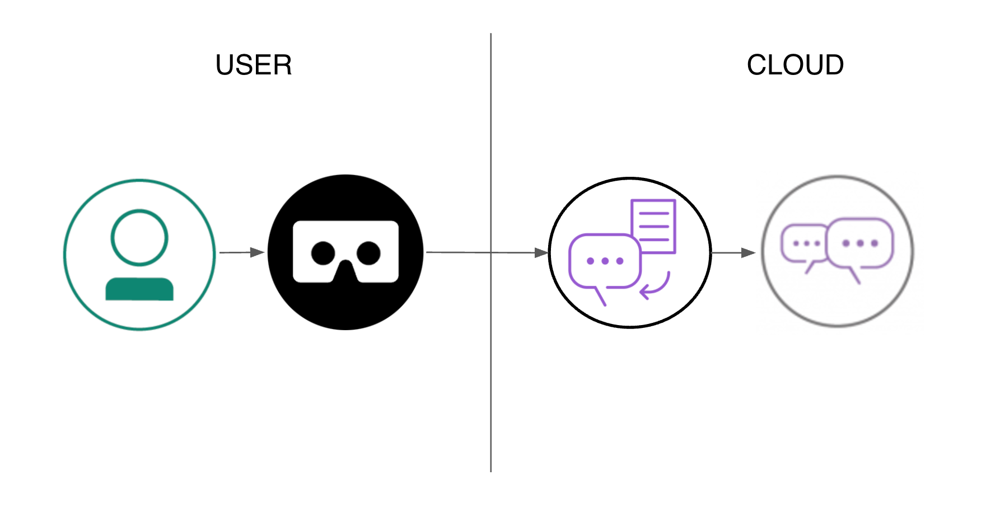

# Crie comandos de voz para experiências de RV com os serviços do Watson 
*Ler em outros idiomas: [한국어](README-ko.md).* 

Nesta jornada do desenvolvedor, criaremos um game de Realidade Virtual com base nos serviços [Speech-to-Text](https://www.ibm.com/watson/developercloud/speech-to-text.html) do Watson e [Conversation](https://www.ibm.com/watson/developercloud/conversation.html) do Watson. 
Na Realidade Virtual, na qual você “habita” o espaço de verdade, a fala pode parecer uma interface mais natural do que outros métodos. A disponibilização de controles por fala permite que os desenvolvedores criem experiências mais imersivas. O HTC Vive é o 3º dispositivo mais popular de RV para colocar na cabeça (sem contar o Google Cardboard) e um candidato ideal para a interação por fala, tendo vendido cerca de [400 mil unidades](http://www.hypergridbusiness.com/2016/11/report-98-of-vr-headsets-sold-this-year-are-for-mobile-phones) em 2016. 

Após concluir esta jornada, o leitor saberá como: 
* Incluir os serviços IBM Watson Speech-to-Text e IBM Watson Conversation em um ambiente de Realidade Virtual desenvolvido no Unity. 
 
### With Watson 
Deseja levar seu aplicativo do Watson ao próximo nível? Quer aproveitar os ativos da marca Watson? Participe do programa [With Watson](https://www.ibm.com/watson/with-watson), que oferece recursos técnicos, de marketing e da marca exclusivos para amplificar e acelerar sua solução comercial incorporada do Watson. 
## Componentes inclusos 
* [IBM Watson Conversation](https://www.ibm.com/watson/developercloud/conversation.html): Crie um chatbot com um programa que faça uma conversa por métodos auditivos ou textuais. 
* [IBM Watson Speech-to-Text](https://www.ibm.com/watson/developercloud/speech-to-text.html): Converta voz por áudio em texto escrito. ## Tecnologias utilizadas 
* [Unity](https://unity3d.com/): Um mecanismo de game multiplataformas usado para desenvolver videogames para PC, consoles, dispositivos móveis e websites. 
# Etapas 
1. [Antes de começar](#1-before-you-begin) 
2. [Crie serviços do Bluemix](#2-create-bluemix-services) 
3. [Desenvolvimento e execução](#3-building-and-running) 
## 1. Antes de começar 
* [Conta do IBM Bluemix](http://ibm.biz/Bdimr6) 
* [PC “pronto para RV”](https://www.vive.com/us/ready/) 
* [HTC Vive](https://www.vive.com/us/product/) 
* [SteamVR](http://store.steampowered.com/steamvr) 
* [Unity](https://unity3d.com/get-unity/download) 
* [Blender](https://www.blender.org/) 
## 2. Crie serviços do Bluemix 

Na sua máquina local: 
1. `git clone https://github.com/IBM/vr-speech-sandbox-vive.git` 
2. `cd vr-speech-sandbox-vive`
No [Bluemix](https://console.ng.bluemix.net/):
1. Crie uma instância de serviço do [Speech-To-Text](https://console.ng.bluemix.net/catalog/speech-to-text/).
2. Crie uma instância de serviço do [Conversation](https://console.ng.bluemix.net/catalog/services/conversation/).
3. Quando vir os serviços no painel, selecione o serviço Conversation que foi criado e clique no botão .
4. Depois de efetuar login na Conversation Tool, clique no botão .
5. Importe o arquivo do Conversation [`workspace.json`](data/workspace.json) localizado no seu clone deste repositório. 
## 3. Desenvolvimento e execução 
Se você seguiu as etapas anteriores, já deve estar dentro do seu clone local e pronto para começar a executar o aplicativo no Unity. 
1. `git clone https://github.com/watson-developer-cloud/unity-sdk.git` 
2. Abra o Unity e, dentro do ativador de projeto, selecione o botão . 
3. Navegue até o local onde clonou este repositório e abra o diretório “Creation Sandbox”. 
4. Se for exibido um prompt pedindo para fazer upgrade do projeto para uma versão mais recente do Unity, faça isso. 
5. Siga [estas instruções](https://github.com/watson-developer-cloud/unity-sdk#getting-the-watson-sdk-and-adding-it-to-unity) para incluir no projeto o SDK do Watson Unity transferido por download na 1ª etapa. 
6. Siga [estas instruções](https://github.com/watson-developer-cloud/unity-sdk#configuring-your-service-credentials) para incluir suas credenciais dos serviços Speech To Text e Conversation (localizadas no [IBM Bluemix](https://console.ng.bluemix.net/)). 
7. Selecione `Advanced Mode` na janela de configuração.
8. Clique em `Add Variable` e nomeie sua nova variável `ConversationV1_ID` e, em seguida, defina seu valor como o ID da área de trabalho do Conversation.  Para localizar o ID da área de trabalho, selecione o menu de expansão na área de trabalho do Conversation e selecione `View details`. 

9. Instale o [Blender](https://www.blender.org)
10. Na guia do projeto do editor do Unity, selecione Assets-&gt;Scenes-&gt;MainGame-&gt;MainMenu e clique duas vezes para carregar a cena.
11. Pressione Play. # Saída de amostra  
# Links 
* [Demonstração da versão do Cardboard no YouTube](https://www.youtube.com/watch?v=rZFpUpy4y0g) 
* [Viveport](https://www.viveport.com/apps/bbde0cff-98c1-4117-acd8-e808ded515ca) 
* [Blog do Desenvolvedor](https://www.ibm.com/innovation/milab/watson-speech-virtual-reality-unity/) 
* [Estudo de Caso](https://www.ibm.com/innovation/milab/work/speech-sandbox/) 
* [SDK do Watson Unity](https://github.com/watson-developer-cloud/unity-sdk) 
# Licença 
[Apache 2.0](LICENÇA) 
