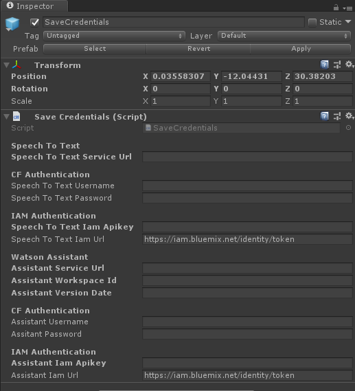

# WARNING: This repository is no longer maintained :warning:

> This repository will not be updated. The repository will be kept available in read-only mode. Refer to https://github.com/IBM/vr-speech-sandbox-cardboard/ for a similar example.

# Create voice commands for VR experiences with Watson services

*Read this in other languages: [한국어](README-ko.md), [中国](README-cn.md).*

In this Code Pattern we will create a Virtual Reality game based on Watson's [Speech-to-Text](https://www.ibm.com/watson/services/speech-to-text/) and Watson's [Assistant](https://www.ibm.com/cloud/watson-assistant/) services.

In Virtual Reality, where you truly “inhabit” the space, speech can feel like a more natural interface than other methods. Providing speech controls allows developers to create more immersive experiences. The HTC Vive is the 3rd most popular head-mounted VR devices (not including Google Cardboard) and an ideal candidate for Speech interaction, selling roughly [400 thousand units](https://www.hypergridbusiness.com/2016/11/report-98-of-vr-headsets-sold-this-year-are-for-mobile-phones) in 2016.

When the reader has completed this Code Pattern, they will understand how to:

* Add IBM Watson Speech-to-Text and Assistant to a Virtual Reality environment build in Unity.


## Flow

1. User interacts in virtual reality and gives voice commands such as "Create a large black box".
2. The HTC Vive Headset microphone picks up the voice command and the running application sends it to Watson Speech-to-Text.
3. Watson Speech-to-Text converts the audio to text and returns it to the running Application that powers the HTC Vive.
4. The application sends the text to Watson Assistant. Watson Assistant returns the recognized intent "Create" and the entities "large", "black", and "box". The virtual reality application then displays the large black box (which falls from the sky).

## Included components

* [IBM Watson Assistant](https://www.ibm.com/cloud/watson-assistant/): Create a chatbot with a program that conducts a conversation via auditory or textual methods.
* [IBM Watson Speech-to-Text](https://www.ibm.com/watson/services/speech-to-text/): Converts audio voice into written text.

## Featured technologies

* [Unity](https://unity3d.com/): A cross-platform game engine used to develop video games for PC, Mac, consoles, mobile devices and websites.

# Watch the Video

[](https://youtu.be/h5nY3st62Qg)

# Steps

1. [Before you begin](#1-before-you-begin)
2. [Create IBM Cloud services](#2-create-ibm-cloud-services)
3. [Building and Running](#3-building-and-running)

## 1. Before You Begin

* [IBM Cloud Account](https://www.ibm.com/cloud/)
* ["VR Ready" PC](https://www.vive.com/us/ready/)
* [HTC Vive](https://www.vive.com/us/product/vive-virtual-reality-system/)
* [SteamVR](https://store.steampowered.com/steamvr)
* [Unity](https://unity3d.com/get-unity/download)
* [Blender](https://www.blender.org/)

## 2. Create IBM Cloud services

On your local machine:
```bash
git clone https://github.com/IBM/vr-speech-sandbox-vive.git
cd vr-speech-sandbox-vive
```

In [IBM Cloud](https://cloud.ibm.com):

* Create a [Speech-To-Text](https://cloud.ibm.com/catalog/services/speech-to-text) service instance.
* Create an [Assistant](https://cloud.ibm.com/catalog/services/conversation/) service instance.

#### Import the Assistant workspace.json:

* Find the Assistant service in your IBM Cloud Dashboard.
* Click on the service and then click on `Launch tool`.
* Go to the `Skills` tab.
* Click `Create new`
* Click the `Import skill` tab.
* Click `Choose JSON file`, go to your cloned repo dir, and `Open` the workspace.json file in [`data/workspace.json`](data/workspace.json).
* Select `Everything` and click `Import`.

To find the `WORKSPACE_ID` for Watson Assistant:

* Go back to the `Skills` tab.
* Find the card for the workspace you would like to use. Look for `IBM Speech Sandbox Vive`.
* Click on the three dots in the upper right-hand corner of the card and select `View API Details`.
* Copy the `Workspace ID` GUID. Save it configuration later.


## 3. Building and Running

> Note: This has been compiled and tested using Unity 2018.2.14f1 and Watson Unity SDK from the Unity asset Store as of July 24, 2018 and tested with the `develop` branch of the github unity-sdk as of `commit d1ce5607ebb77 Nov 1 2018`.

> Note: If you are in *any* IBM Cloud region other than US-South you *must* use Unity 2018.2 or higher. This is because Unity 2018.2 or higher is needed for TLS 1.2, which is the only TLS version available in all regions other than US-South.

1. Download the [Unity SDK for Watson](https://github.com/watson-developer-cloud/unity-sdk) or perform the following:

```bash
git clone https://github.com/watson-developer-cloud/unity-sdk.git
```

Make sure you are on the develop branch.
1. Open Unity and inside the project launcher select the  button.
1. Navigate to where you cloned this repository and open the `Creation Sandbox` directory.
1. If prompted to upgrade the project to a newer Unity version, do so.
1. Follow [these instructions](https://github.com/watson-developer-cloud/unity-sdk#getting-the-watson-sdk-and-adding-it-to-unity) to add the Watson Unity SDK downloaded in step 1 to the project.
1. Follow [these instructions](https://github.com/watson-developer-cloud/unity-sdk#configuring-your-service-credentials) to create your Speech To Text and Watson Assistant services and find their credentials (using [IBM Cloud](https://cloud.ibm.com)
 You can find your workspace ID by selecting the expansion menu on your assistant workspace and selecting `View details`.

    

1. In the Unity Hierarchy view, click on `_Scenes`->`MainGame`->`MainMenu` and then the `SaveCredentials` object.
1. In the Inspector you will see Variables for `Speech To Text` and `Watson Assistant` and either `CF Authentication` for the Cloud Foundry username and password, or the `IAM Authentication` if you have the IAM apikey. Since you only have only one version of these credentials, fill out only one of the two for each service.
1. Fill out the `Speech To Text Service Url`, the `Assistant Service Url`, the `Assistant Workspace Id`, and the `Assistant Version Date`. There are tool tips which will show help and any defaults.



1. Install [Blender](https://www.blender.org)
1. In the Unity editor project tab, select `Assets`->`Scenes`->`MainGame`->`MainMenu` and double click to load the scene.
1. Press Play

# Links

* [Youtube Video](https://youtu.be/h5nY3st62Qg)
* [Demo of Cardboard version on Youtube](https://www.youtube.com/watch?v=rZFpUpy4y0g)
* [Viveport](https://www.viveport.com/apps/bbde0cff-98c1-4117-acd8-e808ded515ca)
* [Watson Unity SDK](https://github.com/watson-developer-cloud/unity-sdk)
* [Blog](https://developer.ibm.com/code/2017/04/29/easily-set-voice-commands-virtual-reality-watson/)
* [Another blog!](https://developer.ibm.com/code/2017/06/10/create-affordable-virtual-reality-experience-google-cardboard/)
* [Article about VR Speech Sandbox](https://www.techleer.com/articles/385-ibm-watson-to-get-a-new-vr-speech-sandbox-feature/)
* [News article about Star Trek Bridge Crew](https://www.prnewswire.com/news-releases/ibm-and-ubisoft-partner-to-bring-voice-command-with-watson-to-virtual-reality-in-star-trek-bridge-crew-300455924.html)


# Learn more

* **Artificial Intelligence Code Patterns**: Enjoyed this Code Pattern? Check out our other [AI Code Patterns](https://developer.ibm.com/technologies/artificial-intelligence/).
* **AI and Data Code Pattern Playlist**: Bookmark our [playlist](https://www.youtube.com/playlist?list=PLzUbsvIyrNfknNewObx5N7uGZ5FKH0Fde) with all of our Code Pattern videos
* **With Watson**: Want to take your Watson app to the next level? Looking to utilize Watson Brand assets? [Join the With Watson program](https://www.ibm.com/watson/with-watson/) to leverage exclusive brand, marketing, and tech resources to amplify and accelerate your Watson embedded commercial solution.

# License

This code pattern is licensed under the Apache Software License, Version 2.  Separate third party code objects invoked within this code pattern are licensed by their respective providers pursuant to their own separate licenses. Contributions are subject to the [Developer Certificate of Origin, Version 1.1 (DCO)](https://developercertificate.org/) and the [Apache Software License, Version 2](https://www.apache.org/licenses/LICENSE-2.0.txt).

[Apache Software License (ASL) FAQ](https://www.apache.org/foundation/license-faq.html#WhatDoesItMEAN)
